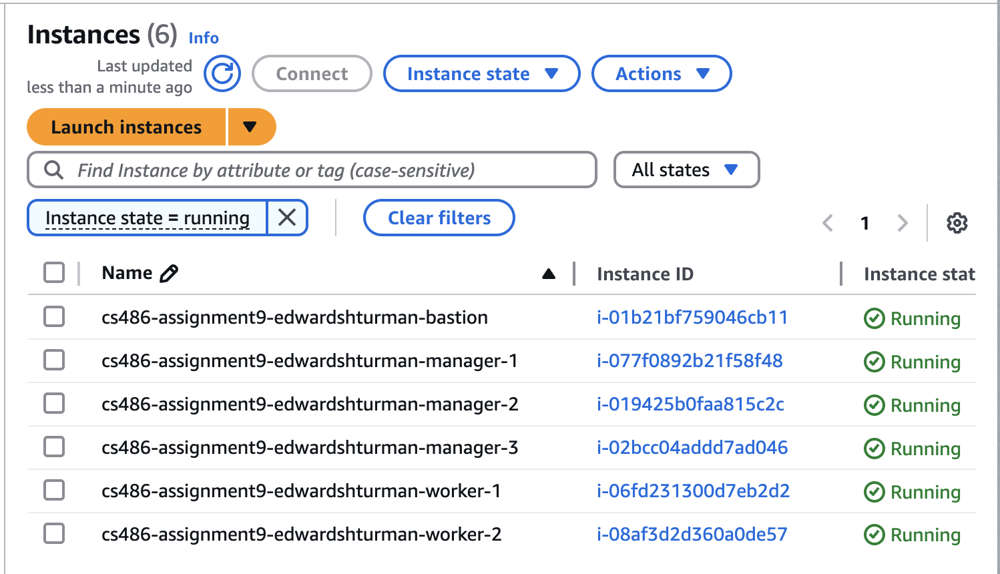

# CS 486 Assignment 9

Implementation details and instructions for using Terraform with Packer

> [!NOTE]
> These instructions have been tested on Mac. Please seek alternative installation methods for your operating system if need be.

## Prerequisites

- The **Packer CLI**
- The **Terraform CLI**

You can install these with [Homebrew](https://brew.sh):

```zsh
brew tap hashicorp/tap
brew install hashicorp/tap/packer
brew install hashicorp/tap/terraform
```

## Setup

Get started by cloning this repo on your machine:

```zsh
git clone https://github.com/edwardshturman/cs486-assignment9.git cs486-assignment9-edwardshturman
cd cs486-assignment9-edwardshturman
```

### Required variables

#### AWS credentials

You'll need to configure your AWS credentials before Packer or Terraform can provision infrastructure. Specifically, you must provide the `AWS_ACCESS_KEY_ID` and `AWS_SECRET_ACCESS_KEY` variables. This can be done by:

- Exporting to your environment:

  ```zsh
  export AWS_ACCESS_KEY_ID="<your AWS access key ID>"
  export AWS_SECRET_ACCESS_KEY="<your AWS secret access key>"
  ```

- Using a shared credentials file:

  ```zsh
  echo "[default]" >> ~/.aws/credentials
  echo "aws_access_key_id = <your AWS access key ID>" >> ~/.aws/credentials
  echo "aws_secret_access_key = <your AWS secret access key>" >> ~/.aws/credentials
  ```

- A few other methods, but the above two are most convenient. When in doubt, see [the examples from the Packer docs](https://developer.hashicorp.com/packer/integrations/hashicorp/amazon#environment-variables).

#### `allow_ssh_ip`

By setting this Terraform variable, your IP will be whitelisted in the bastion host's incoming connection rules.

Set `allow_ssh_ip` to your public IPv4:

```zsh
echo "allow_ssh_ip = \"$(curl -s ifconfig.me)\"" >> terraform.tfvars
```

#### `public_key`

You can specify the public RSA key from a keypair to be linked to the bastion host, so that you can SSH into it.

Make a new keypair and copy the public key:

```zsh
ssh-keygen -t rsa -b 2048 -m PEM -N "" -f bastion-key
echo "public_key = \"$(cat bastion-key.pub)\"" >> terraform.tfvars
```

## Building an image with Packer

```zsh
packer init aws.pkr.hcl
packer build aws.pkr.hcl
```

The AMI ID from the output will automatically be added as `ami` to the Terraform variables for use in the next step.

## Creating infrastructure with Terraform

We're all good to go to launch our five EC2 instances (two worker nodes, three manager nodes) using our AMI created with Packer and a bastion host.

```zsh
terraform init
terraform apply
```

You should now see six running instances in `us-west-1`.



## Connecting to an instance

You can SSH into the bastion host by running:

```zsh
ssh -A -i bastion-key ubuntu@<bastion public IPv4>
```

From there, you can connect to any one of the EC2 instances by using the private IPv4:

```zsh
ssh ubuntu@<EC2 private IPv4>
```

You can verify Docker was installed successfully and is running by creating a container for the `hello-world` image:

```zsh
sudo docker run hello-world
```
